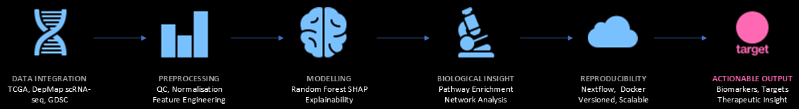

# RISHIKA   MADHANAGOPAL

  <strong>BIOINFORMATICS ENGINEER &nbsp; • &nbsp; SCIENTIFIC SOFTWARE &nbsp; • &nbsp; MULTI-OMICS SYSTEMS</strong>

 

  ⌜ &nbsp;&nbsp;&nbsp;&nbsp;&nbsp;&nbsp;&nbsp;&nbsp;&nbsp;&nbsp;&nbsp;&nbsp;&nbsp;&nbsp;&nbsp;&nbsp;&nbsp;&nbsp;&nbsp;&nbsp;&nbsp;&nbsp;&nbsp;&nbsp;&nbsp;&nbsp;&nbsp;&nbsp;&nbsp;&nbsp;&nbsp;&nbsp;&nbsp;&nbsp;&nbsp;&nbsp;&nbsp;&nbsp;&nbsp;&nbsp;&nbsp;&nbsp;&nbsp;&nbsp;&nbsp;&nbsp;&nbsp;&nbsp;&nbsp;&nbsp; ⌝ 
  <i>I design robust analytical systems that extract reliable   
  insights from complex biological data.</i> 
  ⌞ &nbsp;&nbsp;&nbsp;&nbsp;&nbsp;&nbsp;&nbsp;&nbsp;&nbsp;&nbsp;&nbsp;&nbsp;&nbsp;&nbsp;&nbsp;&nbsp;&nbsp;&nbsp;&nbsp;&nbsp;&nbsp;&nbsp;&nbsp;&nbsp;&nbsp;&nbsp;&nbsp;&nbsp;&nbsp;&nbsp;&nbsp;&nbsp;&nbsp;&nbsp;&nbsp;&nbsp;&nbsp;&nbsp;&nbsp;&nbsp;&nbsp;&nbsp;&nbsp;&nbsp;&nbsp;&nbsp;&nbsp;&nbsp;&nbsp;&nbsp; ⌟

 

<table border="0">
  <tr>
    <td align="center"> <b>BIOLOGY</b> Understanding systems at molecular resolution</td>
    <td align="center"> <b>DATA</b> Turning noisy data into structured information</td>
    <td align="center"> <b>ENGINEERING</b> Building reproducible, scalable pipelines</td>
    <td align="center"> <b>IMPACT</b> Translating insights into real-world outcomes</td>
  </tr>
</table>

## 01 FEATURED WORK

   
  <h3>Multi-Omic Drug Sensitivity</h3>
  
Integrated TCGA, DepMap & scRNA-seq to predict drug response in breast cancer.

  <ul>
    <li>IGKV1-5 & ALPL identified via SHAP</li>
    <li>Pathway & Network Analysis</li>
    <li>XAI for Biomarker Discovery</li>
  </ul>
  <a href="LINK_HERE">View Project →</a>

   
  <h3>Genomics Pipeline on AWS</h3>
  
End-to-end NGS workflow on AWS for scalable variant discovery and analysis.

  <ul>
    <li>FastQC . BWA . GATK . Samtools</li>
    <li>Automated with Nextflow, Docker</li>
    <li>S3 . EC2 . Batch . Lambda</li>
  </ul>
  <a href="LINK_HERE">View Project →</a>

   
  <h3>Immune Cell Clustering in RA</h3>
  
Density-based clustering of cytometry data to identify immune cell populations.

  <ul>
    <li>OPTICS clustering</li>
    <li>UMAP & t-SNE visualisation</li>
    <li>Biomarker discovery for RA states</li>
  </ul>
  <a href="LINK_HERE">View Project →</a>

## 02 PIPELINE AT A GLANCE

  

## 03 TECH STACK

<table border="0" cellpadding="10" cellspacing="0">
  <tr>
    <td align="right"><b>PROGRAMMING & DATA</b></td>
    <td>
      
      
      
      
    </td>
  </tr>
  <tr>
    <td align="right"><b>BIOINFORMATICS</b></td>
    <td>
      
      
      
      
    </td>
  </tr>
  <tr>
    <td align="right"><b>MACHINE LEARNING</b></td>
    <td>
      
      
      
    </td>
  </tr>
  <tr>
    <td align="right"><b>DEVOPS & CLOUD</b></td>
    <td>
      
      
      
      
    </td>
  </tr>
  <tr>
    <td align="right"><b>VISUALISATION</b></td>
    <td>
      
      
      
    </td>
  </tr>
</table>

## 04 PHILOSOPHY
> [!IMPORTANT]
> **Bioinformatics isn't just about analysing data.** It's about building systems that keep working when the data doesn't behave.

  

    🛡️ <b>Robust by Design:</b> Anticipate failures. Engineer reliability.
  

  

    🔍 <b>Explainable Always:</b> Interpretability builds trust in science.
  

  

    🚀 <b>Impact Driven:</b> Insights should translate to real-world value.
  

## 05 LET'S CONNECT

  
📧 &nbsp; <b>Email:</b> <a href="mailto:rishikamadhanagopal@outlook.com">rishikamadhanagopal@outlook.com</a>

  
🔗 &nbsp; <b>LinkedIn:</b> <a href="https://www.linkedin.com/in/rishikam">linkedin.com/in/rishikam</a>

  
📍 &nbsp; <b>Location:</b> Newcastle Upon Tyne, UK

  

 

  
  
    

  

   
  <i>"Good models predict. Great systems survive real data."</i>

