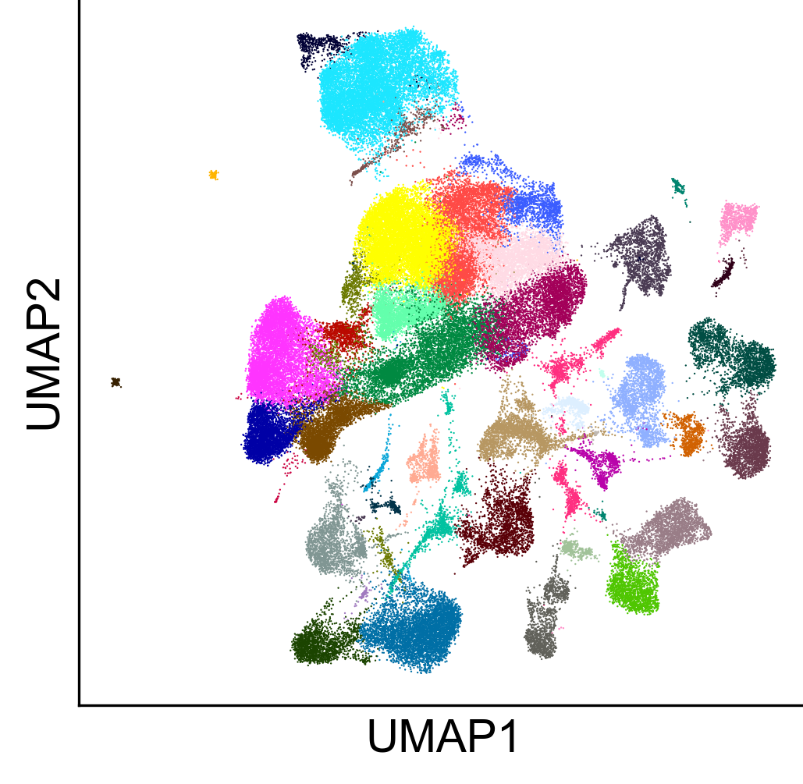
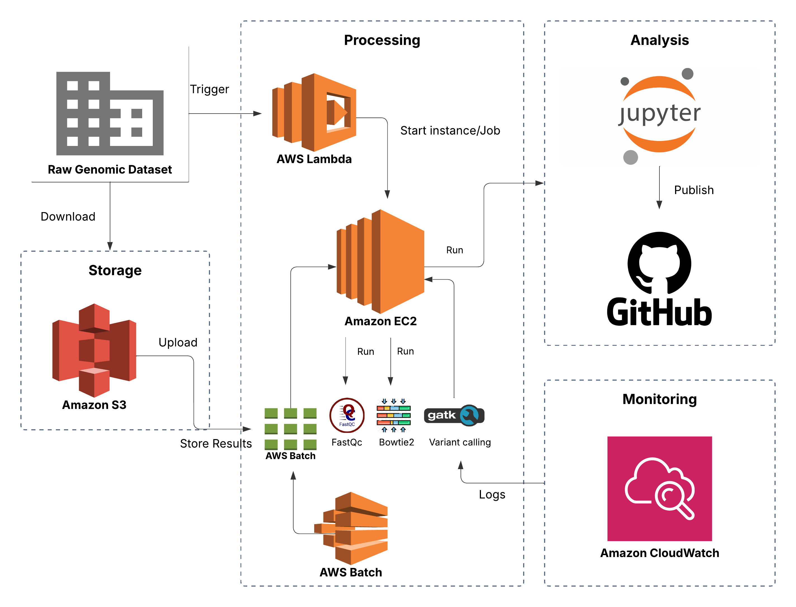
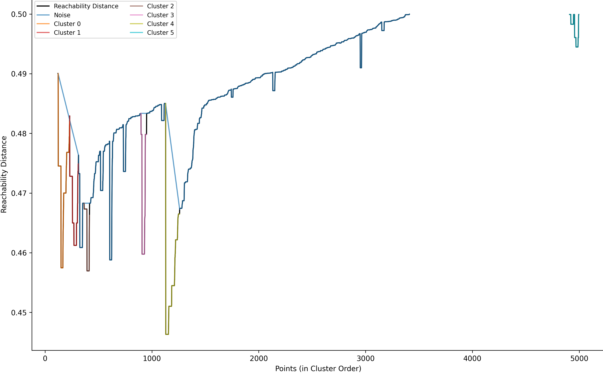

# RISHIKA   MADHANAGOPAL

  <strong>BIOINFORMATICS ENGINEER &nbsp; • &nbsp; SCIENTIFIC SOFTWARE &nbsp; • &nbsp; MULTI-OMICS SYSTEMS</strong>

 

  ⌜ &nbsp;&nbsp;&nbsp;&nbsp;&nbsp;&nbsp;&nbsp;&nbsp;&nbsp;&nbsp;&nbsp;&nbsp;&nbsp;&nbsp;&nbsp;&nbsp;&nbsp;&nbsp;&nbsp;&nbsp;&nbsp;&nbsp;&nbsp;&nbsp;&nbsp;&nbsp;&nbsp;&nbsp;&nbsp;&nbsp;&nbsp;&nbsp;&nbsp;&nbsp;&nbsp;&nbsp;&nbsp;&nbsp;&nbsp;&nbsp;&nbsp;&nbsp;&nbsp;&nbsp;&nbsp;&nbsp;&nbsp;&nbsp;&nbsp;&nbsp; ⌝ 
  <i>I design robust analytical systems that extract reliable   
  insights from complex biological data.</i> 
  ⌞ &nbsp;&nbsp;&nbsp;&nbsp;&nbsp;&nbsp;&nbsp;&nbsp;&nbsp;&nbsp;&nbsp;&nbsp;&nbsp;&nbsp;&nbsp;&nbsp;&nbsp;&nbsp;&nbsp;&nbsp;&nbsp;&nbsp;&nbsp;&nbsp;&nbsp;&nbsp;&nbsp;&nbsp;&nbsp;&nbsp;&nbsp;&nbsp;&nbsp;&nbsp;&nbsp;&nbsp;&nbsp;&nbsp;&nbsp;&nbsp;&nbsp;&nbsp;&nbsp;&nbsp;&nbsp;&nbsp;&nbsp;&nbsp;&nbsp;&nbsp; ⌟

 

<table border="0">
  <tr>
    <td align="center"> <b>BIOLOGY</b> Understanding systems at molecular resolution</td>
    <td align="center"> <b>DATA</b> Turning noisy data into structured information</td>
    <td align="center"> <b>ENGINEERING</b> Building reproducible, scalable pipelines</td>
    <td align="center"> <b>IMPACT</b> Translating insights into real-world outcomes</td>
  </tr>
</table>

## 01 FEATURED WORK
<table border="0">
  <tr>
    <td width="33%" valign="top">
      
      <h3>Multi-Omic Drug Sensitivity</h3>
      
Integrated TCGA, DepMap & scRNA-seq to predict drug response in breast cancer.

      <ul align="left">
        <li>IGKV1-5 & ALPL identified via SHAP</li>
        <li>Pathway & Network Analysis</li>
        <li>XAI for Biomarker Discovery</li>
      </ul>
      <a href="https://github.com/Rishika-Madhanagopal/Precision-Oncology-XAI.git">View Project →</a>
    </td>
    <td width="33%" valign="top">
      
      <h3>Genomics Pipeline on AWS</h3>
      
End-to-end NGS workflow on AWS for scalable variant discovery and analysis.

      <ul align="left">
        <li>FastQC . BWA . GATK . Samtools</li>
        <li>Automated with Nextflow, Docker</li>
        <li>S3 . EC2 . Batch . Lambda</li>
      </ul>
      <a href="https://github.com/Rishika-Madhanagopal/Bioinformatics_Pipeline_AWS.git">View Project →</a>
    </td>
    <td width="33%" valign="top">
      
      <h3>Immune Cell Clustering in RA</h3>
      
Density-based clustering of cytometry data to identify immune cell populations.

      <ul align="left">
        <li>OPTICS clustering</li>
        <li>UMAP & t-SNE visualisation</li>
        <li>Biomarker discovery for RA states</li>
      </ul>
      <a href="https://github.com/Rishika-Madhanagopal/Rheumatoid-Arthritis.git">View Project →</a>
    </td>
  </tr>
</table>

## 02 PIPELINE AT A GLANCE

<table border="0" cellpadding="0" cellspacing="0">
  <tr align="center" valign="top">
    <td>
       
      <b>INTEGRATION</b>
    </td>
    <td valign="middle" width="30">
      
    </td>
    <td>
       
      <b>PREPROCESSING</b>
    </td>
    <td valign="middle" width="30">
      
    </td>
    <td>
       
      <b>MODELLING</b>
    </td>
    <td valign="middle" width="30">
      
    </td>
    <td>
       
      <b>INSIGHT</b>
    </td>
    <td valign="middle" width="30">
      
    </td>
    <td>
       
      <b>REPRODUCIBILITY</b>
    </td>
    <td valign="middle" width="30">
      
    </td>
    <td>
       
      <b>OUTPUT</b>
    </td>
  </tr>
</table>

## 03 TECH STACK
| | |
| :--- | :--- |
| **LANGUAGES** |    |
| **ANALYSIS** |   |
| **DEVOPS** |    |

---

## 04 PHILOSOPHY
> [!IMPORTANT]
> **Bioinformatics isn't just about analysing data.** It's about building systems that keep working when the data doesn't behave.

* 🛡️ **Robust by Design**: Anticipate failures. Engineer reliability.
* 🔍 **Explainable Always**: Interpretability builds trust in science.
* 🚀 **Impact Driven**: Insights should translate to real-world value.

---

## 05 LET'S CONNECT
<table border="0" width="100%">
  <tr>
    <td width="50%" valign="top">
      📧 rishikamadhanagopal@outlook.com  
      🔗 www.linkedin.com/in/rishikam  
      📍 Newcastle Upon Tyne, UK   
      <code>Open to opportunities in Bioinformatics/Data Scientist</code>
    </td>
    <td width="50%">
      
    </td>
  </tr>
</table>

  

<i>Good models predict. Great systems survive real data.</i>

